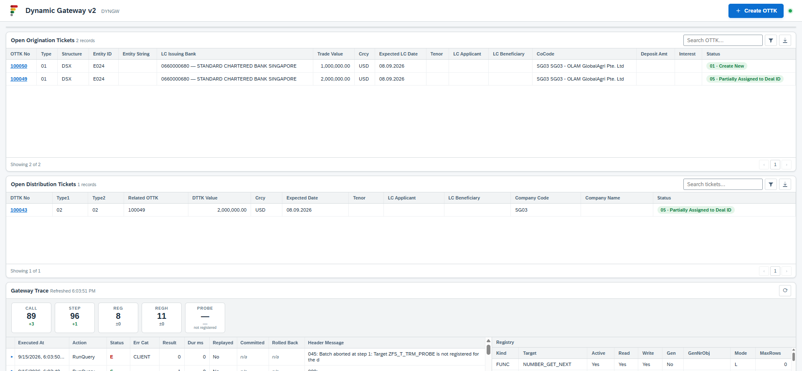
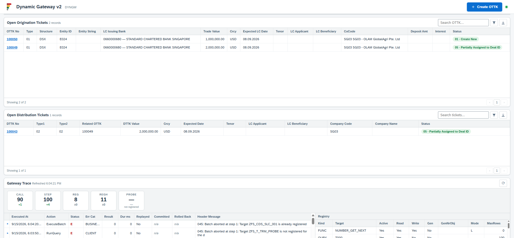
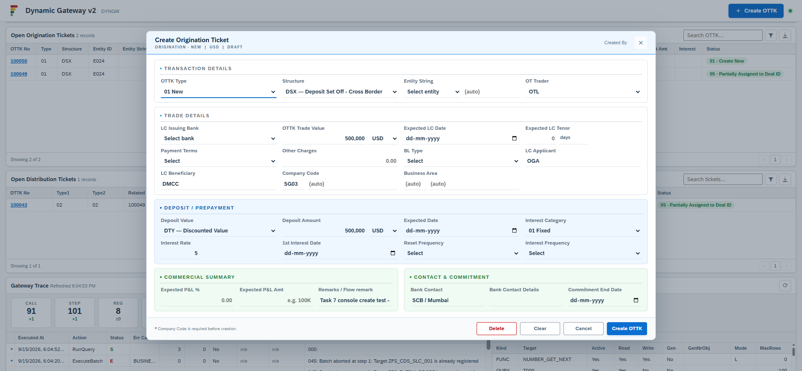
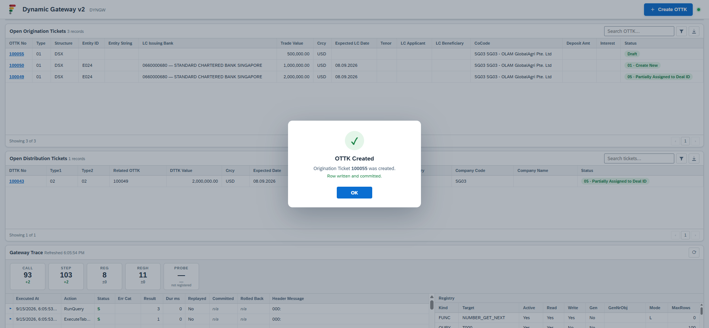
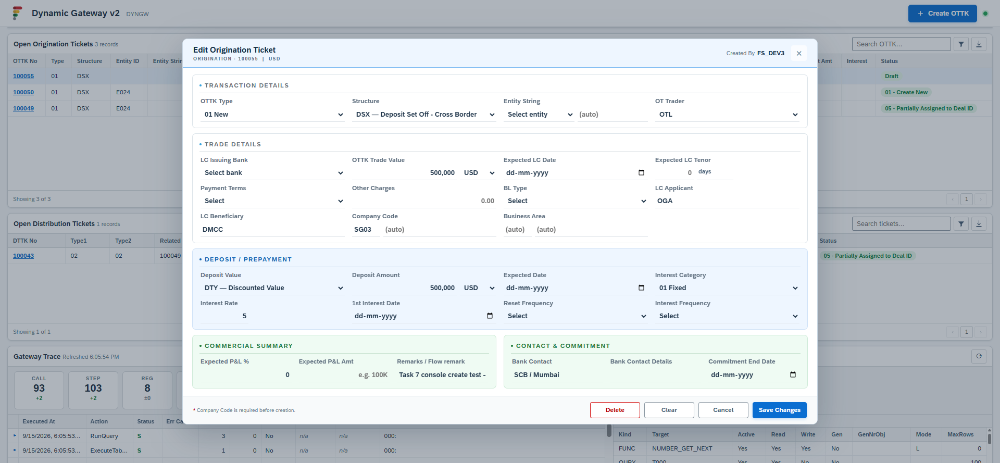
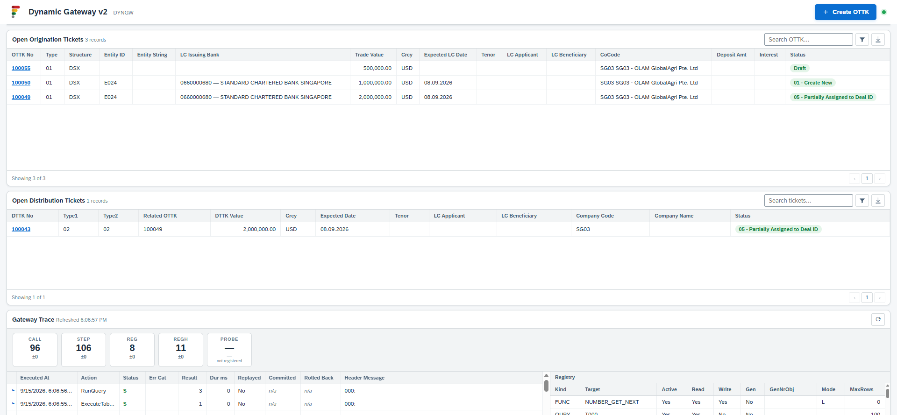
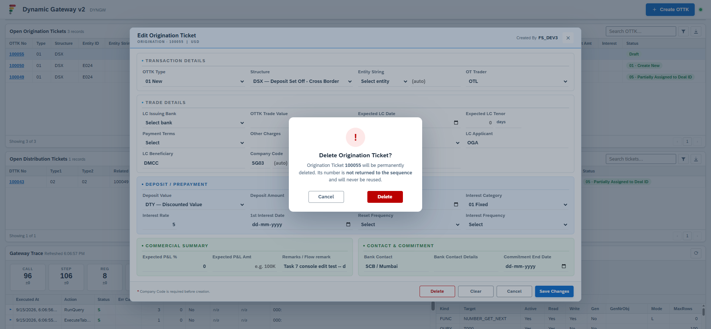
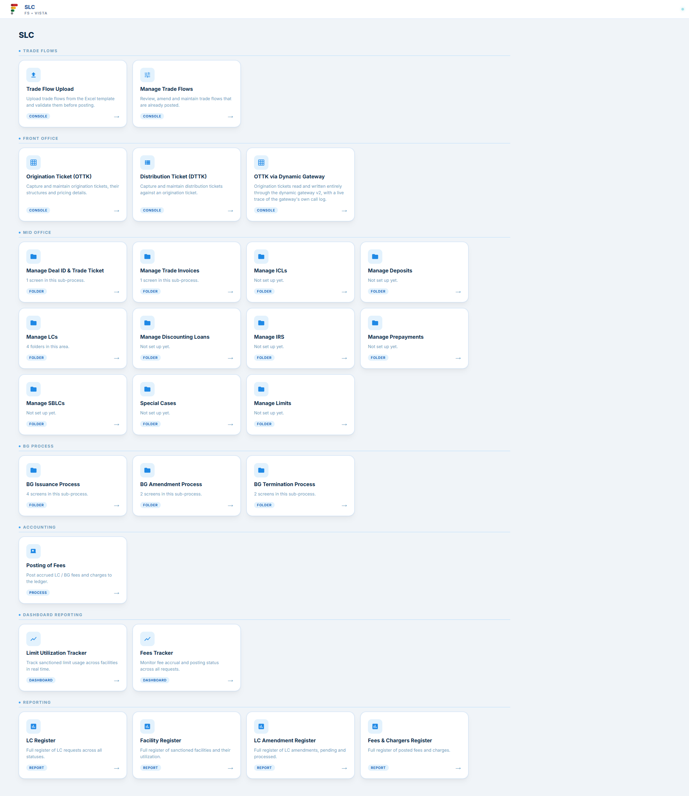

# Test case — dyngw v2 console (Phase 2), live build and end-to-end run

> **Paths moved on 2026-09-15.** `web/` was split into `web/dynamic-gw/` (the gateway
> consoles) and `web/individual/` (the consoles on dedicated OData services), so every
> `web/<name>-console/` path below now reads `web/dynamic-gw/dyngw-v2-console/` or
> `web/individual/<name>-console/`. Ports are unchanged. The paths are left as written
> because this document records a build as it happened — see L-528.

**What this document is.** The seven-task build of `web/dyngw-v2-console/` (port 8773), an OTTK
console whose every read and write goes through the Dynamic Gateway v2
(`ZFS_SB_DYNGW_O4_API`) rather than a dedicated OData service. **All seven tasks passed.** The
run closes with an end-to-end proof through the real UI: a real ticket (`ZOTTK_NO 100055`) was
created, edited and deleted, with the gateway generating `UUID`, `ZOTTK_NO` (from number range
`ZFS_OTTK_D`) and the audit block server-side.

| | |
|---|---|
| **System** | `DS4`, client `100` (`DS4_100_NIIF`) |
| **Executed by** | Karthik R (karthik.r@fourthsignal.com) |
| **Date** | 2026-09-15 |
| **Service** | `ZFS_SB_DYNGW_O4_API` (v2) |
| **Console** | `web/dyngw-v2-console/` — `proxy.py`, `sap_config.json`, `index.html`, port 8773 |
| **Plan** | `docs/superpowers/plans/2026-09-15-1642-dyngw-v2-console.md` (7 tasks) |
| **Spec** | `docs/superpowers/specs/2026-09-15-1353-dyngw-v2-generators-design.md` §13, as amended by Phase 1 |
| **Task reports** | `.superpowers/sdd/2026-09-15-1642-dyngw-v2-console/task-1-report.md` … `task-7-report.md` (task-8: integration-guide addition) |
| **Controller ledger** | `.superpowers/sdd/2026-09-15-1642-dyngw-v2-console/progress.md` |
| **Worklog** | `worklog/DS4_100_NIIF/2026-09/2026-09-15-1642-dyngw-v2-console.md` |
| **Evidence** | `worklog/DS4_100_NIIF/2026-09/evidence/2026-09-15-1642-dyngw-v2-console/` — 10 screenshots + `create-request-response.txt` |
| **ABAP objects** | None created or changed — this is a pure `web/` build against the already-live v2 service |

## Result — 7 of 7 tasks pass

| Task | Scope | Result |
|---|---|---|
| 1 | Scaffold console + family wiring (9 configs, hub tile) | **PASS** — 2 latent proxy bugs found and fixed |
| 2 | `dynCall()`/`stepDetail()`, registry gating, provisioning batch | **PASS** — L-523 found |
| 3 | OTTK/DTTK list panels + Task 1 review fix-round | **PASS** — L-524 found |
| 4 | Gateway Trace panel (counts, call log, registry) | **PASS** — L-525, L-526 found |
| 5 | Create OTTK modal (first real write) | **PASS** — `ZOTTK_NO 100054` created |
| 6 | Edit and delete, read-modify-write, never partial | **PASS** — zero-count guard proved first |
| 7 | Live smoke test and evidence | **PASS** — `ZOTTK_NO 100055` created, edited, deleted |

Task 8 (not numbered above — added by human request after Task 7) appended a "building a browser
console over this service" section to `docs/dyngw-v2-integration-guide.md`, so the next console
built against dyngw v2 is copy-and-wire rather than rediscovery. Not a test-case criterion; noted
for completeness.

---

## 1 · What the console is

Eight `web/*-console` apps already exist, each talking to its own dedicated OData service.
`web/dyngw-v2-console/` is the ninth, and the first that talks to SAP through **no dedicated
service at all** — every list load, create, edit and delete is a call against
`ZFS_SB_DYNGW_O4_API`'s generic actions (`RunQuery`, `ExecuteTableCrud`, `ExecuteBatch`,
`RegisterTarget`), through the same proxy pattern the other eight consoles use. It reuses the
OTTK/DTTK screens and styling from `web/ottk-dttk-console/` verbatim where possible, and carries
a fourth panel — **Gateway Trace** — that the reference console has no equivalent of, showing the
gateway's own `CallLog`/`CallStep`/`Registry`/`RegistryHistory` tables filling up live as the
console is used.

## 2 · Task-by-task build

### Task 1 — scaffold and family wiring (PASS)

Copied `web/ottk-dttk-console/proxy.py` into `web/dyngw-v2-console/proxy.py`, added a `dyngw`
service entry to all nine `web/*/sap_config.json` files, added the "OTTK via Dynamic Gateway"
tile to `web/slc-menu-console/index.html`. `$metadata` confirmed live: `GenerateJson` is a
`<Parameter>` on `ExecuteTableCrud`, `IsCommitted`/`IsRolledBack` are `<Property>` entries on
`ZFS_AE_DynGwResult`.

**Two real bugs found and fixed, in `web/dyngw-v2-console/proxy.py` only:**
1. A forced `Accept: application/json` header broke `$metadata` (XML-only in OData v4) with a
   406 — made conditional: XML for paths ending in `$metadata`, JSON otherwise.
2. `_service_url` unconditionally appended `&sap-client=<client>`, duplicating the parameter and
   producing a 400 URI syntax error when the caller already supplied `sap-client=100` — now
   skipped if the query already contains `sap-client=`.

**Ruling (controller): accepted, not propagated to the eight sibling proxies.** Both bugs are
latent there — none of the eight ever calls `$metadata`, and none of their pages supplies
`sap-client` itself (their proxies add it) — so editing eight live, working consoles for a bug
none of them can hit was judged an unrequested change. Recorded for whoever next touches a
sibling proxy.

**Task 1 review** caught two further defects, independently confirmed by the controller
(diffing the actual `<style>` blocks and grepping for `icon`, not trusting the implementer's
report):

1. **CSS not verbatim.** The reference `<style>` block is 104 lines; the copy was 77 — missing
   exactly the 27-line "Screenshot-inspired request modal" override block, which re-overrides
   `.modal-content-grid` rules an earlier section sets. Invisible at Task 1 (no modal exists
   yet); would have made Task 5's Create OTTK modal render in an older design.
2. **Hub tile emitted `d="undefined"`.** `slc-menu-console/index.html` renders
   `'<path d="'+it.icon+'"/>'` unconditionally, and the new tile was the only one in the file
   lacking an `icon` field — an invalid SVG path, visibly broken on the hub page.

Both are examples of review catching what the implementer's own report claimed was done. Fixed
in Task 3 as a labelled "Step 0," folded in rather than spent as a separate dispatch because both
edits target the same file Task 3 was already touching.

### Task 2 — `dynCall()`, registry gating, provisioning (PASS)

Built `dynCall(action, payload)` — throws unless `ExecStatus === 'S'`, surfaces the step's real
message rather than the header's truncated 045, and passes a `Severity 'W'`/048 partial write
through as `result.dynWarning` instead of throwing. Built `stepDetail(d)`, the message-extraction
helper: tries the inline `StepsJson` first (`ExecuteBatch`, lowercase keys), falls back to
`GET /CallLog(<GwUuid>)?$expand=_Steps` (single-shot actions, PascalCase `_Steps`) when
`StepsJson` is empty.

Registered four targets in one `ExecuteBatch` of `REGI` steps — `ZFS_CDS_SLC_001`,
`ZFS_CDS_SLC_002`, `ZSGSLCTR_BPEXT`, `T000`, all `QURY`/`SELECT` — leaving the already-registered
`ZFS_SLC_OTTK_BTP` untouched.

Both checks proved live through the console UI, not curl:
- **Liveness:** `RunQuery` on `T000` → `ExecStatus S, ResultCount 3` — three clients (000/050/100).
- **Refusal:** `RunQuery` on `ZZ_UNKNOWN` → HTTP 200, `ExecStatus E`; the UI correctly surfaced
  the step's `017: Target ZZ_UNKNOWN is not registered for the dynamic gateway`, not the header's
  truncated 045.

**Finding — L-523**, correcting the task's own brief: a single-shot action's direct POST response
carries `StepsJson` as `""` — there is no inline per-step detail at all, success or refusal.
`dynCall()` falls back to `GET /CallLog(<GwUuid>)?$expand=_Steps` for the real message, costing
one extra round trip on the (uncommon) error path.

### Task 3 — OTTK/DTTK list panels (PASS)

Copied the two list panels from `web/ottk-dttk-console/index.html` verbatim (columns, widths,
order, pager), fed by `loadOttk()`/`loadDttk()` calling `dynCall('RunQuery', ...)` against
`ZFS_CDS_SLC_001`/`ZFS_CDS_SLC_002` with explicit `FieldsJson` and descending `OrderByJson`.

**Row counts rendered:** Open Origination Tickets — 2 records (`ZOTTK_NO` 100050, 100049); Open
Distribution Tickets — 1 record (`ZDTTK_NO` 100043). Verified against an independent
`mcp-abap-abap-adt-api` `runQuery` on `ZFS_SLC_OTTK_BTP` — same 2 rows, same top `ZOTTK_NO`.

**Finding — L-524:** the initial `MaxRows:200` request was refused live with message **025**
("Requested row count 200 exceeds the registered limit 100"), even though the actual result sets
are 2 and 1 rows — Task 2's provisioning had registered both CDS targets with `MaxRows:100`. A
registered `MaxRows` is a hard ceiling on the caller's own `MaxRows`, not a default. Fixed to
`MaxRows:100`.

**Blank columns, by design, not a bug:** OTTK panel — Entity String, Tenor, LC Applicant, LC
Beneficiary, Deposit Amt, Interest; DTTK panel — Tenor, LC Applicant, LC Beneficiary, Company
Name. The backing CDS views carry no such fields; headers are kept, cells render empty. No second
query was fired against `ZFS_SLC_OTTK_BTP` to fill any of them.

**Review: clean** (spec OK, quality approved, zero Critical/Important). One deferred minor:
`renderOrig`/`renderDist` pass a literal `''` to `looseMatch` for filters with no backing CDS
field — harmless today because those selects offer only the "All …" option, but would silently
empty every row if a later task populated them with real values. Carried into Task 6, which edits
the same render functions; fixed there (`looseMatch(x,'')` replaced with an explicit `true` at 5
call sites, with a comment).

### Task 4 — Gateway Trace panel (PASS)

Built the fourth panel:
- **Counts strip** — `CALL`, `STEP`, `REG`, `REGH` via `$top=0&$count=true` (true totals, not the
  `$top=50` page size below), each showing its delta since the previous in-memory reading. `PROBE`
  via `dynCall('RunQuery', ...)` against `ZFS_T_TRM_PROBE`, gated on the live Registry row.
- **Call-log table** — one row per call, click to expand `_Steps`, header and step message shown
  side by side so the 045-vs-017 split is legible.
- **Registry / RegistryHistory tables**, including `AllowGen`/`GenNrObject`.

`refreshTrace()` is wired into every write and diagnostic action, and queues rather than drops a
refresh requested while one is already in flight.

**First-load counters:** `CALL 48, STEP 55, REG 7, REGH 10, PROBE -- (not registered)`. After
"Run liveness check": `CALL 49 (+1), STEP 56 (+1)` — the exact delta the panel exists to
demonstrate. Independently verified: direct `SELECT COUNT(*) FROM ZFS_T_DYN_CALL` returned 57,
matching the panel's `CALL` counter read at the same point in the sequence.

**Finding — L-525:** `IsCommitted`/`IsRolledBack` exist only on `ZFS_AE_DynGwResult` (the action's
own response shape), not on `CallLogType` (the persisted entity `GET /CallLog` reads). Confirmed
by reading `$metadata` and a live row — `CallLogType`'s full property list has no such columns.
An auditor reading `/CallLog` after the fact cannot recover the transaction outcome; the panel
renders both columns `n/a` with an explanatory tooltip rather than guessing from `ExecStatus`.

**Finding — L-526:** `ZFS_T_TRM_PROBE` is registered (`TargetKind TABL, AllowRead true`) but
`RunQuery` still refuses it: header 045, step **017**, `RegUuid` all-zero. `RunQuery` dispatches a
`QURY`-kind step; the one registry row for this target is keyed `TargetKind TABL`. Registration
and dispatch kind must match — "registered" and "usable by this action" are different questions.

**Ruling:** do not register `ZFS_T_TRM_PROBE` a second time as `QURY` just to make a counter read
0 — that grants a live privilege for a cosmetic display. The panel's "not registered" with the 017
in a tooltip stays honest. Task 7's independent `tableContents` check is stronger evidence anyway,
since it needs no registration at all. A related design tradeoff, not a finding: reading `PROBE`
itself writes a new `CallLog`/`CallStep` row, so it is re-queried only on first load and the
panel's own refresh button — not on every automatic refresh — to avoid the trace panel polluting
the very log it displays.

### Task 5 — Create OTTK modal, the first real write (PASS)

Copied the `ottkModal` (5 sections), footer and `successModal` from
`web/ottk-dttk-console/index.html`. **One deliberate deviation:** the reference's "Other Charges"
field is a readonly field backed by a Charges popup against `SlcOttkFee`, which has no dyngw v2
registration and was out of scope (no ABAP objects this task) — mapped instead to a plain
editable amount field (`ZOTH_FEE`); the Charges popup was not copied.

`buildOttkRow()` returns every column of `ZFS_SLC_OTTK_BTP` the console knows about, `''`/`0`
where unset, never omitted — the complete-row discipline L-520 (Phase 1) requires, built here so
Task 6 can reuse it for `MODIFY`. Omits only `UUID`, `ZOTTK_NO`, the five RAP audit columns
(filled server-side by `GenerateJson`), and `CLIENT`.

Save handler: `ExecuteTableCrud INSERT` with `GenerateJson {Uuid:['UUID'],
NumberRange:[{Field:'ZOTTK_NO', Object:'ZFS_OTTK_D'}], SysFields:'AUDIT'}`, reading the assigned
`ZOTTK_NO` from the response's `RowsJson` — no re-query.

**Live proof (Playwright):** filled a representative ticket and clicked Create once — no retries
needed. `ExecStatus S`, no `Severity W`. Success modal: *"Origination Ticket **100054** was
created."*

**Independent verification** (`mcp-abap-abap-adt-api`, not the gateway that wrote it) —
`ZOTTK_NO 100054`: `UUID 5254001FE7A21FD1AC9DD3CD7767E000` (non-initial), `LOCAL_CREATED_BY
FS_DEV3`, `LOCAL_CREATED_AT 20260915121713.227`, all business fields matching what was typed.

**Trace delta:** `CALL +2 / STEP +2`, not +1 — the `ExecuteTableCrud INSERT`, then `loadOttk()`'s
own `RunQuery` refresh, each logging its own row. Confirms `refreshTrace()` is wired to the create
path.

### Task 6 — edit and delete, read-modify-write, never partial (PASS)

**Precondition:** `ZFS_SLC_OTTK_BTP` registered a second time under `TargetKind QURY` (the
existing `TABL` row untouched), because Step 1's full-row read uses `RunQuery` — proved live, no
035.

**Step 1 — full-row read.** `RunQuery` filtered on `ZOTTK_NO`, `FieldsJson ''` (all fields) —
returned 70 columns including `UUID` and `LOCAL_CREATED_BY`. **Save/Delete buttons stay disabled
until this read completes**; the modal is populated only from it, never from the 13-column list
row (`ZFS_CDS_SLC_001` carries no `UUID` at all — the controller's own pre-flight conflict scan
had flagged this dependency as **F-1** before Task 6 was dispatched, and required the buttons be
gated on it rather than trust the list row).

**Step 2/3 — edit (MODIFY).** `buildOttkRowForSave()` = the full Step-1 row spread, overlaid only
with the mapped/edited form fields — every unmapped column, including `UUID`, `ZOTTK_NO` and the
RAP audit columns, passes through untouched. `GenerateJson {"SysFields":"AUDIT"}` only. Edited
`ZOTTK_NO 100054`'s `ZREMARK`: `ExecStatus S, ResultCount 1`.

Independent verify:

| Field | Before | After |
|---|---|---|
| `LOCAL_CREATED_BY` | `FS_DEV3` | `FS_DEV3` (unchanged) |
| `LOCAL_CREATED_AT` | `20260915121713.227` | `20260915121713.227` (unchanged) |
| `LOCAL_LAST_CHANGED_AT` | `20260915121713.227` | `20260915122842.43` (advanced) |
| `ZREMARK` | original | edited text — edit took |
| `ZSTR`/`ZBUKRS`/`ZOTTK_CURR`/`ZOTTK_VALUE` | unchanged | unchanged — full row survived |

**Step 4/4a — delete.** `Operation DELETE`, `GenerateJson ''`, `ImportJson [{UUID, ZOTTK_NO}]`,
custom confirm modal.

- **Zero-count guard proved first — destroys nothing.** `editingRow.UUID` was deliberately
  corrupted to match no row → `ExecStatus S, ResultCount 0` (gateway message 048, "0 of 1 row(s)
  written"). The console guard checks `ResultCount`, not the message text: showed "Delete failed
  — nothing was deleted, the key did not match (ResultCount 0)," row stayed in the list.
  Independently confirmed all 3 rows still present, `100054`'s real UUID unchanged.
- **Real delete:** fresh full read (real UUID) → Confirm → `ExecStatus S, ResultCount 1`, toast
  *"Origination Ticket 100054 deleted."* Independently confirmed `ZFS_SLC_OTTK_BTP` now holds
  exactly `100049`/`100050` — the human's two rows, never touched.

The zero-count guard's negative control returned gateway message 048 rather than a bare silent
success like L-522's original `MODIFY_TABLE` case — a different ABAP path (`DELETE` dynamic key
resolution) producing the same `ResultCount 0` shape. Worth knowing the exact wording differs from
L-522's own example if anyone greps the call log for it; the console guard checks the count either
way, so the variation doesn't change the outcome.

### Task 7 — live smoke test and evidence (PASS)

Full run through the real UI (Playwright against `http://localhost:8773/`), in order: registry
gating check → `T000` liveness → both lists already rendered → create → edit → delete → probe
stayed empty throughout. Both proxies (port 8773 and 8771) were started fresh — neither was
running at task start.

**`ZOTTK_NO 100055`** — exactly the number predicted (100051–100054 already spent by Phase 1 and
Task 5). Created with `ExecuteTableCrud INSERT`, edited with `MODIFY`, deleted with `DELETE`
(keyed on `UUID`, per L-522). Independently confirmed before and after: `ZFS_SLC_OTTK_BTP` holds
exactly `100049`/`100050` both times — net effect zero.

**Trace deltas per action:**

| Action | CALL / STEP | Note |
|---|---|---|
| Provision (all targets already registered) | +1 / +4 | refused **035** at step 1 — gating reads real state |
| `T000` liveness | +1 / +1 | clean single call |
| Create 100055 | +2 / +2 | INSERT + list refresh |
| Edit 100055 | +3 / +3 | row read + MODIFY + list refresh |
| Delete 100055 | +3 / +3 | row read + DELETE + list refresh |

Run total: **CALL 89 → 99, STEP 96 → 109**. `REG`/`REGH` flat throughout — no target was
registered or changed during the run itself. Provision's refusal (035, "already registered")
correctly proves the gating UI reads real state, not a cache. Edit and delete are each +3, not
+1, because the full-row read required by Task 6's F-1 gate, the write, and the panel's own
post-write list refresh are each a separate `CallLog`/`CallStep` row — this +2/+3 shape was
already established in Tasks 5–6 and reproduced identically here.

`ZFS_T_TRM_PROBE` stayed "-- (not registered)" in the panel on every trace refresh this task
triggered; `mcp-abap-abap-adt-api tableContents` confirmed it held 0 rows both before and after —
the negative control held throughout, independently.

**Hub tile:** confirmed live on `http://localhost:8771/` — the "OTTK via Dynamic Gateway" tile
launches `http://localhost:8773/`, and its `<svg><path>` now carries a real non-empty `d`
attribute (Task 3's fix to Task 1's `d="undefined"` bug holds).

---

## 3 · Not exercised

The run did **not** exercise, and this is stated plainly rather than rounded up into the pass
tally:

- **Column filters and search boxes.**
- **The pager** — present as copied furniture, but not wired to `SkipRows`; both panels cap at
  the registered `MaxRows` of 100 (invisible today at 2 and 1 rows, but a hard ceiling for real
  use — human's call whether to raise the registered `MaxRows` or wire the pager).
- **CSV export.**
- **The 048/`Severity W` partial-write rendering** — proved separately in Task 6 (the zero-count
  delete guard), not repeated in Task 7.
- **The 017 refusal through the UI** — proved in Task 2 (the `ZZ_UNKNOWN` check), not repeated.
- **The blank mirrored columns** — tenor, LC applicant, LC beneficiary, deposit, interest — blank
  by design (the backing CDS views carry no such fields), not a defect.
- **"Other Charges"** — a plain editable field in this console, **not** the reference console's
  fee-breakdown popup against `SlcOttkFee` (Task 5's deliberate scope boundary).
- **The entity/bank/refInt dropdowns** — placeholder-only; no lookup service is wired into this
  console.

## 4 · The evidence gap

Raw request/response bodies were captured only for the **create** call
(`create-request-response.txt`, headers fully captured, body capturable via
`browser_network_request`). The browser's network buffer was cleared by a later page navigation
before the edit and delete calls could be pulled, so no raw payload file exists for either. Those
two actions are evidenced instead by UI state (toasts, modal text), the Gateway Trace table's own
recorded deltas, and independent `tableContents` reads before/after — not a gap in what was
proved, only in what was archived as a raw file. The evidence set for this run is **not uniform**
across the three write actions, and that asymmetry is recorded here rather than smoothed over.

## 5 · Findings

- **L-523** — a single-shot action's response carries `StepsJson` as `""`; step detail needs
  `GET /CallLog(<GwUuid>)?$expand=_Steps`. Corrected an assumption in the build's own brief.
- **L-524** — `RunQuery`'s `MaxRows` is capped by the target's **registered** `MaxRows`, not just
  the request; asking 200 against a target registered at 100 is refused with message **025**.
- **L-525** — `IsCommitted`/`IsRolledBack` are returned on the action result but are **not
  persisted** to `ZFS_T_DYN_CALL` (confirmed by reading the table's DDIC source and `$metadata`).
  An auditor reading `/CallLog` afterward cannot see the transaction outcome. **L-497 was
  narrowed, not closed** — this is a real Phase 1 limitation found by its first consumer, and
  fixing it needs DDIC/CDS/BDEF/log-writer changes on the ABAP side, out of scope for this
  web/-only build.
- **L-526** — registration kind must match dispatch kind: a `TABL` row does not authorise a
  `QURY` read, so `ZFS_SLC_OTTK_BTP` needed two registrations (one `TABL`, one `QURY`) to support
  both `ExecuteTableCrud` and the edit/delete path's `RunQuery` full-row read.

**Two defects Task 1's review caught and Task 3 fixed**, recorded above in §2 as examples of
review catching what the implementer's own report claimed was done: a non-verbatim CSS copy that
would have made Task 5's Create OTTK modal render in an older design, and a hub tile emitting
`d="undefined"`.

## 6 · Figures

Ten screenshots, in run order, from
`worklog/DS4_100_NIIF/2026-09/evidence/2026-09-15-1642-dyngw-v2-console/`:

**Figure 1 — initial load.** The console on first render: registry gating table, four provisioned
targets, empty OTTK/DTTK panels populated, Gateway Trace counts strip.

**Figure 2 — provision refused, already registered.** Clicking "Provision targets" against a
system where all targets are already live: refused **035**, proving the gating UI reads real
state rather than a cached assumption.

**Figure 3 — `T000` liveness check.** The Diagnostics panel's liveness check against `T000`:
`ExecStatus S, ResultCount 3`.

**Figure 4 — Create OTTK modal, filled.** The five-section create form populated with the test
ticket's values, immediately before Save.

**Figure 5 — create success, `ZOTTK_NO 100055`.** The success modal after the real INSERT,
showing the gateway-generated ticket number.

**Figure 6 — edit modal, populated from the full-row read.** The edit form after Step 1's
`RunQuery` full-row read — Save/Delete only become enabled at this point.

**Figure 7 — edit saved.** Confirmation after the `MODIFY` write, `ResultCount 1`.

**Figure 8 — delete confirmation modal.** The custom confirm dialog before the real `DELETE` is
sent.

**Figure 9 — delete done.** Toast confirming `Origination Ticket 100055 deleted`, row removed
from the list.

**Figure 10 — hub tile icon, fixed.** The "OTTK via Dynamic Gateway" tile on the
`slc-menu-console` hub page, rendering a real SVG icon (Task 3's fix to Task 1's `d="undefined"`
defect holds).

## 7 · Final state

- **`ZFS_SLC_OTTK_BTP`:** two real rows (`100049`, `100050`), unchanged across the whole build.
  Test rows `100054` (Task 5, deleted in Task 6) and `100055` (Task 7, created and deleted in the
  same task) leave permanent gaps in the sequence — consistent with the number-range behaviour
  already documented for this table.
- **Registry:** `ZFS_SLC_OTTK_BTP` now carries two rows (`TABL` and `QURY`), plus
  `ZFS_CDS_SLC_001`, `ZFS_CDS_SLC_002`, `ZSGSLCTR_BPEXT`, `T000` (all `QURY`). `ZFS_T_TRM_PROBE`
  remains registered `TABL` only — deliberately not widened to `QURY`, per the Task 4 ruling.
- **`ZFS_T_DYN_CALL`/`ZFS_T_DYN_STEP`:** grew from `CALL 48 / STEP 55` (start of build) to
  `CALL 99 / STEP 109` (end of Task 7) — the accumulated audit trail of this build's own test
  traffic, itself the console's own proof of concept.
- **Code:** `web/dyngw-v2-console/` (new — `proxy.py`, `sap_config.json`, `index.html`); eight
  sibling `sap_config.json`/`proxy.py` files (docstring/404-text/service-entry only, no logic
  change); `web/slc-menu-console/index.html` (new tile, icon fixed); no ABAP objects touched.
- **Docs:** `docs/dyngw-v2-integration-guide.md` gained §11, "Building a browser console over
  this service" (Task 8).
- **Open, left for the human, by design:** the pager/`MaxRows`-100 ceiling (§3), whether to wire
  entity/bank/refInt lookups, and whether `SlcOttkFee` should be registered on v2 for a real
  Charges popup.
